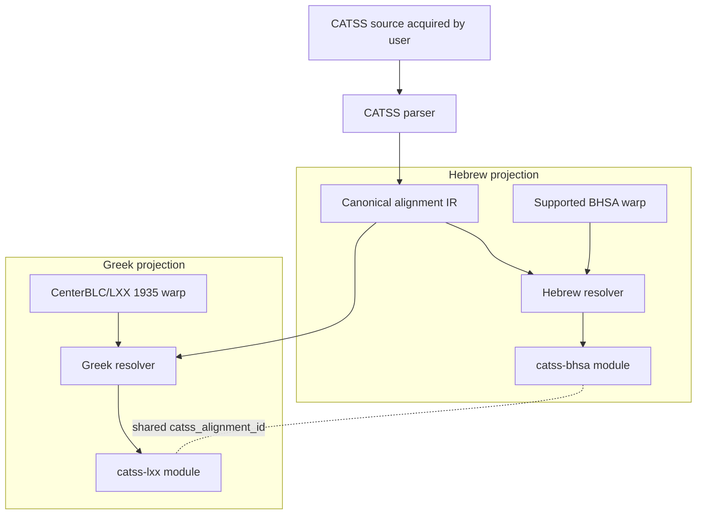

# Initial design

**Design date:** 2026-09-25  
**Status:** bootstrap architecture; unresolved choices are explicitly marked.

## 1. Product boundary

CATSS-TF is a software/materializer repository.

It produces two local Text-Fabric modules from user-acquired CATSS data and user-installed parent corpora:

- `catss-bhsa` for a supported ETCBC/BHSA version;
- `catss-lxx` for CenterBLC/LXX 1935.

It does not publish the source corpora or generated modules.

## 2. Architecture



The parser is shared. Parent-specific mapping lives in resolvers. TF serialization is a final projection step.

## 3. Canonical alignment IR

The IR should preserve CATSS evidence before any parent-corpus mapping.

Provisional model:

```python
AlignmentGroup(
    alignment_id: str,
    source_book: str,
    source_chapter: int,
    source_verse: str,
    source_rows: tuple[int, ...],

    mt_elements: tuple[SourceElement, ...],
    lxx_elements: tuple[SourceElement, ...],
    mt_retroversion: tuple[SourceElement, ...],

    is_lxx_plus: bool,
    is_lxx_minus: bool,
    transposition: Transposition | None,
    ketiv_qere: ...,
    sigla: tuple[str, ...],

    raw_provenance: SourceProvenance,
)
```

This is illustrative, not a frozen public API.

### ID requirement

`catss_alignment_id` must be:

- deterministic from CATSS source identity;
- stable across the two projections;
- independent of BHSA/LXX node numbers;
- insensitive to materialization order;
- able to identify discontinuous/multi-row groups.

The exact ID syntax is a design task after the source grouping rules are tested.

## 4. Text-Fabric projection model

A generated module contains no `otype` or `oslots` replacement and creates no nodes.

Each resolved parent word can receive features such as:

```text
catss_alignment_id
catss_alignment_role
catss_ratio
catss_lxx_plus
catss_lxx_minus
catss_transposition
catss_retroversion
catss_sigla
catss_source_ref
catss_source_rows
catss_mapping_status
```

Feature names are provisional. We should prefer normalized structured features for stable scholarly concepts and retain raw/source metadata for fidelity.

### Multiple group membership

Do not choose a delimiter encoding until CATSS evidence demonstrates whether a parent token can belong to multiple canonical groups. If multiple membership is real and frequent, the design must optimize queryability rather than hiding a list in an opaque string.

## 5. Mapping contracts

### Hebrew resolver

Input:

- canonical CATSS MT-side elements;
- one exact supported BHSA version.

Output:

- resolved BHSA word nodes for each CATSS alignment group;
- explicit mapping diagnostics.

Rules:

- use verse/reference mapping plus token content/normalization validation;
- preserve Ketiv/Qere distinctions rather than flattening them accidentally;
- do not map column-B retroversions to BHSA nodes as if they were MT tokens;
- never resolve by “closest available node”;
- fail/report when tokenization cannot be justified.

### Greek resolver

Input:

- canonical CATSS LXX-side elements;
- CenterBLC/LXX version 1935.

Output:

- resolved LXX word nodes;
- explicit diagnostics.

Common CATSS ancestry is an optimization opportunity, not a correctness assumption.

## 6. Failure model

Materialization is allowed to be partial only when the caller explicitly opts into partial output and receives a machine-readable failure report.

Default behavior for v0.1 should be fail-closed for unexplained mapping drift.

Diagnostics should distinguish at least:

- unsupported book/reference;
- versification mismatch;
- source parse ambiguity;
- parent tokenization mismatch;
- normalization-only mismatch;
- transposition/grouping ambiguity;
- parent version mismatch.

No exception should be silently converted to an omission.

## 7. Provenance

Each generated module must identify:

- CATSS source/acquisition path and source version/checksum where available;
- materializer software version;
- parent repository and exact TF version;
- materialization timestamp;
- unresolved mapping count;
- upstream license/terms references.

Per-alignment source row/reference should remain available where practical.

## 8. Packaging

Initial package name: `catss-tf`; Python import: `catss_tf`.

Command surface begins with source acquisition:

```text
catss-tf fetch <directory>
```

Future issues may extend the same CLI with:

```text
catss-tf materialize bhsa ...
catss-tf materialize lxx ...
catss-tf validate ...
```

Each new subcommand remains issue-driven and RED-first.

## 9. Agora integration

Agora should register materializers only after CATSS-TF has a released, tested standalone materialization interface.

Agora should not:

- own CATSS parsing;
- vendor generated modules;
- repair mapping behavior;
- encode CATSS scholarly semantics independently.

## 10. Explicitly rejected designs

### Combined BHSA+LXX derived corpus

Rejected for v0.1 because it duplicates parent datasets, creates a new node universe, complicates updates, and is unnecessary for the initial research workflows.

### Cross-corpus TF edges using naked node IDs

Rejected because TF node IDs are warp-local.

### Two independent converters

Rejected because CATSS parsing/grouping semantics would drift.

### Prebuilt generated modules in this repository

Rejected because of upstream data licensing and parent-version coupling.


## 11. CATSS source/acquisition contract

The v0.1 materializer boundary is a local CATSS parallel directory. That directory may either already exist or be populated by an explicit user-invoked downloader:

```text
existing local directory ───────┐
                                ├─> direct child *.par files
user invokes CATSS downloader ───┘             |
                                              v
                                  source inspection/fingerprint
                                              |
                                              v
                                         CATSS parser (#4)
```

The downloader retrieves files directly from the upstream CCAT host onto the user's machine. CATSS-TF does not redistribute those files and does not attempt to decide whether a particular user's acquisition/use complies with upstream terms.

### Source directory contract

The configured directory:

- must exist when handed to the parser (the downloader may create it first);
- must contain at least one direct-child `*.par` file;
- is not searched recursively;
- may contain CATSS documentation or unrelated non-`.par` files, which are ignored by the parser input set;
- is fingerprinted before parsing.

The source inspector returns a deterministic manifest sorted by filename. Each entry contains relative filename, byte size, and SHA-256.

### Acquisition design

The downloader is deliberately small and user-invoked. It fetches only the known CATSS parallel `.par` files required by this project, writes them to a user-chosen local directory, and then runs the same source fingerprinting used for pre-existing local data.

License/usage compliance remains the user's responsibility. CATSS-TF records links to upstream terms but does not implement a click-through, registration database, or other policy enforcement.

### Rejected acquisition designs

**Bundle CATSS data in CATSS-TF releases:** rejected because the repository's MIT license does not relicense CATSS data.

**Depend on `curran-gehring/catss`:** rejected as the production source boundary because its code is CC BY-NC 4.0 and it adds a SQLite/morphology layer CATSS-TF does not require.

**Require the full CATSS tree:** rejected because only the parallel alignment is necessary for the initial modules.

**Recursive source discovery:** rejected because it makes source identity dependent on directory layout and risks silently consuming unrelated datasets.

### Downloader behavior

The downloader must be deterministic and testable without network access:

- the set of expected parallel filenames is explicit;
- the CCAT base URL is explicit;
- existing non-empty files are skipped unless overwrite is requested;
- writes are atomic through a temporary file;
- empty responses are rejected;
- tests inject a fake fetch function and never contact CCAT.


## 12. Canonical CATSS parser and IR

Issue #4 freezes the parser boundary before any BHSA/LXX resolution.

### 12.1 Parsed document

```text
ParallelDocument
  source_name
  verses[]
  diagnostics[]

VerseRecord
  book
  chapter
  verse
  header_raw
  header_line_no
  alignments[]

AlignmentRecord
  alignment_id
  source_lines[]
  raw_lines[]
  mt_raw
  lxx_raw
  mt_col_a
  mt_col_b?
  retroversion_kind?
  mt_tokens[]
  mt_ketiv_tokens[]
  mt_qere_tokens[]
  lxx_tokens[]
  ratio
  is_lxx_plus
  is_lxx_minus
  is_ketiv
  is_qere
  transposition_kinds[]
  annotations[]
  column_split
```

All structures are immutable dataclasses.

### 12.2 Source decoding and physical-to-logical line handling

Source files are decoded as strict UTF-8. Invalid byte sequences are a hard parser error; CATSS-TF never substitutes replacement characters into scholarly source data.

Parsing then proceeds in two stages:

1. recognized verse headers partition the file;
2. physical data lines are conservatively joined when CATSS continuation `#` markers show that they belong to one logical row.

A logical row retains every contributing source line number and raw line. The parser never rewrites the source file.

Blank lines do not terminate a verse. This prevents a known class of raw-CATSS corruption from silently splitting data.

### 12.3 Column splitting

Preference order:

1. first tab separates MT and LXX;
2. when no tab exists, a run of at least two spaces may separate columns;
3. otherwise the physical/logical line is retained as an unsplit MT-side cell and a diagnostic is emitted.

An unsplit row remains in the IR.

### 12.4 Column B

The first `=` in the MT cell separates column A from column B. Both the entire raw MT cell and the split values are retained.

Column B is **not** part of `mt_tokens`; it is a reconstruction/annotation layer, not an MT token sequence.

The common column-B introducers are normalized into a short `retroversion_kind` enum (`proper_noun`, `context`, `etymological`, `preposition_difference`, `active_to_passive`, `passive_to_active`, `vocalization`, `vocalization_shin_sin`, `incomplete`, or `plain`). The raw column-B value is still preserved.

### 12.5 Normalized flags

The initial parser recognizes without deleting source markup:

- LXX plus: Hebrew column A begins with `--+`;
- LXX minus: Greek cell begins with `---`;
- Ketiv: single-star Hebrew form;
- Qere: double-star Hebrew form; ketiv and qere are alternative readings of one MT position and therefore do not count as two independent MT alignment tokens;
- local transposition: single `^` or legacy `~`;
- remote transposition: `^^^` or `{...}`-style reflected-elsewhere markup;
- stylistic transposition: `{..^...}`.

The parser may expose additional annotation kinds, but it must not infer a reconstructed sequence or reorder source tokens.

### 12.6 Annotations

`Annotation(side, kind, raw)` is source-preserving.

At minimum:

- known transposition blocks are classified;
- text-bearing wrappers such as `{c...}`, `{..p...}`, `{..d...}`, and `{..r...}` retain their lexical payload while receiving a stable annotation kind;
- `{d}`, `{t}`, `{x}`, `{*}`, and `{**}` receive stable descriptive kinds;
- angle-bracket notes and square-bracket Greek verse references are retained;
- unrecognized brace blocks become `kind="unknown"`.

### 12.7 Token candidates and ratios

`mt_tokens` and `lxx_tokens` are conservative whitespace-level lexical candidates after removing standalone alignment sigla and unwrapping only a small set of well-understood transposition wrappers.

`mt_count` and `lxx_count` are independent integer fields.

Special cases naturally produce:

- LXX plus: `mt_count=0` and `lxx_count=n`;
- LXX minus: `mt_count=n` and `lxx_count=0`.

These counts are parser conveniences, not a claim about Hebrew Vorlage or translation technique.

### 12.8 Diagnostics

Issue #4 emits diagnostics for source structures it cannot confidently split or place, including:

- nonblank content before the first verse header;
- unsplit logical rows;
- malformed continuation chains.

Unknown sigla are not diagnostics by themselves because they are represented losslessly as annotations.

Issue #5 will add corpus-wide validation/invariant reporting.

### 12.9 Explicit non-goals

Issue #4 does not:

- decode Hebrew/Greek Beta code to Unicode;
- apply Cody Kingham's historical patch table;
- map to BHSA or CenterBLC/LXX nodes;
- reorder transposed Greek/Hebrew material;
- decide which CATSS textual-critical judgment is correct;
- compute the later translation-technique feature layer.


## 13. TF compatibility and query-native representation

The parser IR may be structurally rich, but the materialized TF modules must look and behave like ordinary Text-Fabric enrichment features on the parent corpus.

### 13.1 Scalar-first feature model

CATSS concepts should be projected into separate scalar features rather than encoded as JSON, delimited lists, or compound strings.

Preferred examples:

```text
catss_lxx_plus=1
catss_lxx_minus=1
catss_mt_n=1
catss_lxx_n=2
catss_has_retro=1
catss_trans_local=1
catss_trans_remote=1
catss_trans_style=1
catss_ketiv=1
catss_qere=1
catss_doublet=1
catss_translit=1
catss_apparent_pm=1
catss_agrees_ketiv=1
catss_agrees_qere=1
catss_mapping=exact
```

Avoid:

```text
catss_ratio=1:2
catss_flags=plus|remote|doublet
catss_annotations={...json...}
catss_notes=d,x,foo
```

Counts should be integer TF features, booleans integer/presence features, and closed classifications short enumerated strings.

### 13.2 Fit parent-corpus conventions

Both BHSA and CenterBLC/LXX are word-slot corpora with ordinary node features for linguistic properties and standard `book/chapter/verse` sections. CATSS modules should follow the same usage pattern:

- attach word-level CATSS features directly to the corresponding parent word slots;
- use `@valueType=int` for counts/boolean indicators where appropriate;
- use short documented enum values for categorical annotations;
- use edge features only for genuine relations between nodes in the same parent warp;
- avoid storing foreign-corpus node numbers as feature values.

CATSS-specific feature names keep a `catss_` prefix to avoid collisions with parent features such as `gn`, `nu`, `ps`, `lex`, etc.

### 13.3 Raw evidence stays outside routine query features

Lossless CATSS source strings, source physical lines, arbitrary/unknown sigla, and detailed diagnostics remain available for reproducibility, but should normally be written to a deterministic provenance/diagnostic sidecar rather than copied onto every TF word node.

A raw value becomes a TF feature only when there is a concrete query use case for that value itself.

### 13.4 Alignment groups

`catss_alignment_id` is allowed as a scalar join/provenance key, but it must not become the only representation of an alignment.

Ordinary questions such as:

- “LXX plus?”
- “1:n alignment?”
- “remote transposition?”
- “ketiv/qere?”
- “CATSS retroversion present?”

must be answerable directly through atomic TF features without parsing `catss_alignment_id` or consulting a sidecar.

If one parent node belongs to multiple independent CATSS groups, issue #10 must choose a query-native representation after measuring the real multiplicity. A delimited list of IDs is explicitly disallowed.

### 13.5 Consequence for parser IR

Even before TF serialization, the IR should expose future TF atoms directly:

```text
mt_count: int
lxx_count: int
is_lxx_plus: bool
is_lxx_minus: bool
has_retroversion: bool
is_ketiv: bool
is_qere: bool
is_transposition_local: bool
is_transposition_remote: bool
is_transposition_stylistic: bool
```

Rich `annotations[]` and raw source remain alongside these atoms for losslessness, but materializers should not have to re-parse annotation blobs to obtain common searchable properties.


## 14. Validation model

Validation runs on canonical CATSS IR before parent-corpus resolution.

### 14.1 Document accounting

`ParallelDocument` records `data_line_numbers`: every nonblank source line that is not a recognized verse header.

For a valid parse:

```text
data_line_numbers
    ==
alignment source_lines
    UNION
parser diagnostic line numbers
```

A line may both belong to an alignment and carry a diagnostic (for example an unsplit row); that is not loss. A physical source line owned by more than one independent alignment is an error.

Each CATSS parallel file is also expected to use one stable book token in its verse headers. A later header with a different book token is a hard validation error, guarding against verse-like data lines being misclassified as headers.

### 14.2 Typed findings

`ValidationFinding` contains scalar fields:

```text
code
severity = error | unresolved | ignored
source_name
line_no?
alignment_id?
side?
raw?
message
```

No JSON payload is required to understand a finding.

Initial finding codes include:

- `unaccounted_source_line`
- `duplicate_source_line_ownership`
- `alignment_id_mismatch`
- `duplicate_alignment_id`
- `duplicate_source_name`
- `inconsistent_header_book`
- parser diagnostic codes such as `orphan_line`, `unsplit_row`, and `malformed_continuation`
- `unknown_annotation`
- `unknown_mt_strategy_siglum`

### 14.3 Deterministic alignment identity

Validation recomputes every `alignment_id` from the same documented source identity inputs used by the parser. A mismatch is an error.

Duplicate IDs across a validated corpus are errors even if their payloads happen to match.

### 14.4 Policy

Default validation is fail-closed:

- any `error` => invalid;
- any `unresolved` => invalid;
- `ignored` is always explicit through an allow-list of **unresolved** finding codes;
- hard `error` findings cannot be allow-listed.

Allowing an unresolved code never deletes the finding; its severity becomes `ignored`, and `ignored_count` records the policy exception.

### 14.5 Scalar summary

`ValidationSummary` exposes integer counts rather than a compound status blob:

```text
source_files
verses
alignments
source_data_lines
accounted_lines
unaccounted_lines
parser_diagnostics
unknown_annotations
invalid_alignment_ids
duplicate_alignment_ids
duplicate_source_names
inconsistent_header_books
error_count
unresolved_count
ignored_count
```

This summary is the gate consumed by later mapping/materialization work.

### 14.6 Terminology

CATSS is the dataset/project. CCAT is the current upstream distribution host/institutional infrastructure. Validation and TF feature names use CATSS terminology.


## 15. BHSA 2021 parent contract

### 15.1 Supported parent

```text
repository      ETCBC/bhsa
TF version      2021
checkout tag    v1.8.1
checkout git    b112c161cfd21eae403d51a2733740d8743460e7
slot type       word
max slot        426590
section types   book, chapter, verse
```

The materializer must name the parent version explicitly. It does not accept an unqualified `ETCBC/bhsa latest`.

### 15.2 Mapping-critical features

Required v0.1 features:

```text
otype
oslots
book
chapter
verse
g_cons_utf8
g_word_utf8
qere_utf8
```

`g_cons_utf8` is the primary word-form anchor after CATSS Hebrew normalization. `g_word_utf8` and sparse `qere_utf8` provide orthographic/reading alternatives. Morphology and syntax are deliberately outside the identity contract.

`trailer_utf8` and `qere_trailer_utf8` are display/interword material and are not part of lexical identity.

### 15.3 Warp and feature fingerprints

The v0.1 spec records Git blob hashes for every mapping-critical TF file. If the raw parent files are available, materialization should verify them before resolving CATSS data.

A changed `otype` or `oslots` is always incompatible. A changed mapping-critical text/section feature is also rejected until a new parent profile is researched and versioned.

### 15.4 Explicit CATSS source → BHSA book mapping

The parent profile contains a closed table for the 42 supported CATSS parallel sources. It deliberately maps multiple CATSS Greek editions to the same BHSA Hebrew book where appropriate.

Unsupported v0.1 sources:

```text
17.1Esdras
22.Ps151
27.Sirach
42.Baruch
```

They are not mapping failures; they are outside the BHSA projection's declared coverage.

### 15.5 Word-slot identity rules

BHSA word slots are the only target nodes for CATSS word-level annotations.

Resolver rules:

- resolve inside an explicitly identified BHSA book/chapter/verse;
- compare normalized source content to BHSA word-slot text;
- represent Ketiv/Qere as alternatives of the same word slot;
- never split one BHSA qere feature into synthetic slots because it contains whitespace/newlines;
- never use morphology as a fallback identity heuristic;
- never accept ordinal position alone as a match;
- ambiguity remains a mapping diagnostic.

### 15.6 Parent profile verification

Issue #6 supplies a lightweight schema profile independent of the Text-Fabric runtime. It can verify a parent probe containing:

- repository/version/checkout identity;
- slot type and slot/node bounds;
- section types;
- available feature names;
- optional raw-file Git blob hashes.

Issue #7 will bind this contract to an actual Text-Fabric API and implement Hebrew resolution.

### 15.7 TF-feature compatibility

The future `catss-bhsa` module remains a normal BHSA enrichment module. CATSS features are attached to the resolved BHSA word slots using scalar native TF values. Parent BHSA features are not copied into the module.
