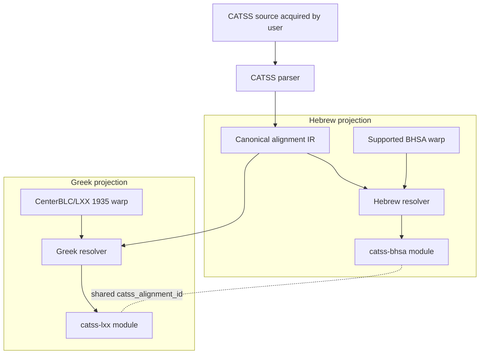

# Initial design

**Design date:** 2026-09-25  
**Status:** bootstrap architecture; unresolved choices are explicitly marked.

## 1. Product boundary

CATSS-TF is a software/materializer repository.

It produces two local Text-Fabric modules from user-acquired CATSS data and user-installed parent corpora:

- `catss-bhsa` for a supported ETCBC/BHSA version;
- `catss-lxx` for CenterBLC/LXX 1935.

It does not publish the source corpora or generated modules.

## 2. Architecture



The parser is shared. Parent-specific mapping lives in resolvers. TF serialization is a final projection step.

## 3. Canonical alignment IR

The IR should preserve CATSS evidence before any parent-corpus mapping.

Provisional model:

```python
AlignmentGroup(
    alignment_id: str,
    source_book: str,
    source_chapter: int,
    source_verse: str,
    source_rows: tuple[int, ...],

    mt_elements: tuple[SourceElement, ...],
    lxx_elements: tuple[SourceElement, ...],
    mt_retroversion: tuple[SourceElement, ...],

    is_lxx_plus: bool,
    is_lxx_minus: bool,
    transposition: Transposition | None,
    ketiv_qere: ...,
    sigla: tuple[str, ...],

    raw_provenance: SourceProvenance,
)
```

This is illustrative, not a frozen public API.

### ID requirement

`catss_alignment_id` must be:

- deterministic from CATSS source identity;
- stable across the two projections;
- independent of BHSA/LXX node numbers;
- insensitive to materialization order;
- able to identify discontinuous/multi-row groups.

The exact ID syntax is a design task after the source grouping rules are tested.

## 4. Text-Fabric projection model

A generated module contains no `otype` or `oslots` replacement and creates no nodes.

Each resolved parent word can receive features such as:

```text
catss_alignment_id
catss_alignment_role
catss_ratio
catss_lxx_plus
catss_lxx_minus
catss_transposition
catss_retroversion
catss_sigla
catss_source_ref
catss_source_rows
catss_mapping_status
```

Feature names are provisional. We should prefer normalized structured features for stable scholarly concepts and retain raw/source metadata for fidelity.

### Multiple group membership

Do not choose a delimiter encoding until CATSS evidence demonstrates whether a parent token can belong to multiple canonical groups. If multiple membership is real and frequent, the design must optimize queryability rather than hiding a list in an opaque string.

## 5. Mapping contracts

### Hebrew resolver

Input:

- canonical CATSS MT-side elements;
- one exact supported BHSA version.

Output:

- resolved BHSA word nodes for each CATSS alignment group;
- explicit mapping diagnostics.

Rules:

- use verse/reference mapping plus token content/normalization validation;
- preserve Ketiv/Qere distinctions rather than flattening them accidentally;
- do not map column-B retroversions to BHSA nodes as if they were MT tokens;
- never resolve by “closest available node”;
- fail/report when tokenization cannot be justified.

### Greek resolver

Input:

- canonical CATSS LXX-side elements;
- CenterBLC/LXX version 1935.

Output:

- resolved LXX word nodes;
- explicit diagnostics.

Common CATSS ancestry is an optimization opportunity, not a correctness assumption.

## 6. Failure model

Materialization is allowed to be partial only when the caller explicitly opts into partial output and receives a machine-readable failure report.

Default behavior for v0.1 should be fail-closed for unexplained mapping drift.

Diagnostics should distinguish at least:

- unsupported book/reference;
- versification mismatch;
- source parse ambiguity;
- parent tokenization mismatch;
- normalization-only mismatch;
- transposition/grouping ambiguity;
- parent version mismatch.

No exception should be silently converted to an omission.

## 7. Provenance

Each generated module must identify:

- CATSS source/acquisition path and source version/checksum where available;
- materializer software version;
- parent repository and exact TF version;
- materialization timestamp;
- unresolved mapping count;
- upstream license/terms references.

Per-alignment source row/reference should remain available where practical.

## 8. Packaging

Initial package name: `catss-tf`; Python import: `catss_tf`.

Command surface begins with source acquisition:

```text
catss-tf fetch <directory>
```

Future issues may extend the same CLI with:

```text
catss-tf materialize bhsa ...
catss-tf materialize lxx ...
catss-tf validate ...
```

Each new subcommand remains issue-driven and RED-first.

## 9. Agora integration

Agora should register materializers only after CATSS-TF has a released, tested standalone materialization interface.

Agora should not:

- own CATSS parsing;
- vendor generated modules;
- repair mapping behavior;
- encode CATSS scholarly semantics independently.

## 10. Explicitly rejected designs

### Combined BHSA+LXX derived corpus

Rejected for v0.1 because it duplicates parent datasets, creates a new node universe, complicates updates, and is unnecessary for the initial research workflows.

### Cross-corpus TF edges using naked node IDs

Rejected because TF node IDs are warp-local.

### Two independent converters

Rejected because CATSS parsing/grouping semantics would drift.

### Prebuilt generated modules in this repository

Rejected because of upstream data licensing and parent-version coupling.


## 11. CATSS source/acquisition contract

The v0.1 materializer boundary is a local CATSS parallel directory. That directory may either already exist or be populated by an explicit user-invoked downloader:

```text
existing local directory ───────┐
                                ├─> direct child *.par files
user invokes CATSS downloader ───┘             |
                                              v
                                  source inspection/fingerprint
                                              |
                                              v
                                         CATSS parser (#4)
```

The downloader retrieves files directly from the upstream CCAT host onto the user's machine. CATSS-TF does not redistribute those files and does not attempt to decide whether a particular user's acquisition/use complies with upstream terms.

### Source directory contract

The configured directory:

- must exist when handed to the parser (the downloader may create it first);
- must contain at least one direct-child `*.par` file;
- is not searched recursively;
- may contain CATSS documentation or unrelated non-`.par` files, which are ignored by the parser input set;
- is fingerprinted before parsing.

The source inspector returns a deterministic manifest sorted by filename. Each entry contains relative filename, byte size, and SHA-256.

### Acquisition design

The downloader is deliberately small and user-invoked. It fetches only the known CATSS parallel `.par` files required by this project, writes them to a user-chosen local directory, and then runs the same source fingerprinting used for pre-existing local data.

License/usage compliance remains the user's responsibility. CATSS-TF records links to upstream terms but does not implement a click-through, registration database, or other policy enforcement.

### Rejected acquisition designs

**Bundle CATSS data in CATSS-TF releases:** rejected because the repository's MIT license does not relicense CATSS data.

**Depend on `curran-gehring/catss`:** rejected as the production source boundary because its code is CC BY-NC 4.0 and it adds a SQLite/morphology layer CATSS-TF does not require.

**Require the full CATSS tree:** rejected because only the parallel alignment is necessary for the initial modules.

**Recursive source discovery:** rejected because it makes source identity dependent on directory layout and risks silently consuming unrelated datasets.

### Downloader behavior

The downloader must be deterministic and testable without network access:

- the set of expected parallel filenames is explicit;
- the CCAT base URL is explicit;
- existing non-empty files are skipped unless overwrite is requested;
- writes are atomic through a temporary file;
- empty responses are rejected;
- tests inject a fake fetch function and never contact CCAT.


## 12. Canonical CATSS parser and IR

Issue #4 freezes the parser boundary before any BHSA/LXX resolution.

### 12.1 Parsed document

```text
ParallelDocument
  source_name
  verses[]
  diagnostics[]

VerseRecord
  book
  chapter
  verse
  header_raw
  header_line_no
  alignments[]

AlignmentRecord
  alignment_id
  source_lines[]
  raw_lines[]
  mt_raw
  lxx_raw
  mt_col_a
  mt_col_b?
  retroversion_kind?
  mt_tokens[]
  mt_ketiv_tokens[]
  mt_qere_tokens[]
  lxx_tokens[]
  ratio
  is_lxx_plus
  is_lxx_minus
  is_ketiv
  is_qere
  transposition_kinds[]
  annotations[]
  column_split
```

All structures are immutable dataclasses.

### 12.2 Source decoding and physical-to-logical line handling

Source files are decoded as strict UTF-8. Invalid byte sequences are a hard parser error; CATSS-TF never substitutes replacement characters into scholarly source data.

Parsing then proceeds in two stages:

1. recognized verse headers partition the file;
2. physical data lines are conservatively joined when CATSS continuation `#` markers show that they belong to one logical row.

A logical row retains every contributing source line number and raw line. The parser never rewrites the source file.

Blank lines do not terminate a verse. This prevents a known class of raw-CATSS corruption from silently splitting data.

### 12.3 Column splitting

Preference order:

1. first tab separates MT and LXX;
2. when no tab exists, a run of at least two spaces may separate columns;
3. otherwise the physical/logical line is retained as an unsplit MT-side cell and a diagnostic is emitted.

An unsplit row remains in the IR.

### 12.4 Column B

The first `=` in the MT cell separates column A from column B. Both the entire raw MT cell and the split values are retained.

Column B is **not** part of `mt_tokens`; it is a reconstruction/annotation layer, not an MT token sequence.

The common column-B introducers are normalized into a short `retroversion_kind` enum (`proper_noun`, `context`, `etymological`, `preposition_difference`, `preposition_addition`, `preposition_omission`, `active_to_passive`, `passive_to_active`, `number_difference`, `vocalization`, `vocalization_shin_sin`, `incomplete`, or `plain`). The raw column-B value is still preserved.

### 12.5 Normalized flags

The initial parser recognizes without deleting source markup:

- LXX plus: Hebrew column A begins with `--+`;
- LXX minus: Greek cell begins with `---`;
- Ketiv: single-star Hebrew form;
- Qere: double-star Hebrew form; ketiv and qere are alternative readings of one MT position and therefore do not count as two independent MT alignment tokens;
- local transposition: single `^` or legacy `~`;
- remote transposition: `^^^` or `{...}`-style reflected-elsewhere markup;
- stylistic transposition: `{..^...}`.

The parser may expose additional annotation kinds, but it must not infer a reconstructed sequence or reorder source tokens.

### 12.6 Annotations

`Annotation(side, kind, raw, family, contextual, payload)` is source-preserving and typed. `raw` always retains the exact source spelling; `payload` exposes wrapper/reference content without requiring downstream reparsing.

At minimum:

- known transposition blocks are classified;
- text-bearing wrappers such as `{c...}`, `{..p...}`, `{..d...}`, and `{..r...}` retain their lexical payload while receiving a stable annotation kind;
- `{d}`, `{t}`, `{x}`, `{*}`, and `{**}` receive stable descriptive kinds;
- Samaritan apparatus references, source notes, simple Greek verse overrides, and complex contextual references are retained as typed reference annotations;\n- raw `{!}...` infinitive-absolute encodings and longer MT dot-strategy codes are decoded without discarding their payload;\n- Sirach uses a book-sensitive manuscript profile for lacunae, reconstructed letters, witness numbers, witness omissions, additions, and fragmentary letters;
- unrecognized brace blocks become `kind="unknown"`.

### 12.7 Token candidates and ratios

`mt_tokens` and `lxx_tokens` are conservative whitespace-level lexical candidates after removing standalone alignment sigla and unwrapping only a small set of well-understood transposition wrappers.

`mt_count` and `lxx_count` are independent integer fields.

Special cases naturally produce:

- LXX plus: `mt_count=0` and `lxx_count=n`;
- LXX minus: `mt_count=n` and `lxx_count=0`.

These counts are parser conveniences, not a claim about Hebrew Vorlage or translation technique.

### 12.8 Diagnostics

Issue #4 emits diagnostics for source structures it cannot confidently split or place, including:

- nonblank content before the first verse header;
- unsplit logical rows;
- malformed continuation chains.

Unknown sigla are not diagnostics by themselves because they are represented losslessly as annotations.

Issue #5 will add corpus-wide validation/invariant reporting.

### 12.9 Explicit non-goals

Issue #4 does not:

- decode Hebrew/Greek Beta code to Unicode;
- apply Cody Kingham's historical patch table;
- map to BHSA or CenterBLC/LXX nodes;
- reorder transposed Greek/Hebrew material;
- decide which CATSS textual-critical judgment is correct;
- compute the later translation-technique feature layer.


## 13. TF compatibility and query-native representation

The parser IR may be structurally rich, but the materialized TF modules must look and behave like ordinary Text-Fabric enrichment features on the parent corpus.

### 13.1 Scalar-first feature model

CATSS concepts should be projected into separate scalar features rather than encoded as JSON, delimited lists, or compound strings.

Preferred examples:

```text
catss_lxx_plus=1
catss_lxx_minus=1
catss_mt_n=1
catss_lxx_n=2
catss_has_retro=1
catss_trans_local=1
catss_trans_remote=1
catss_trans_style=1
catss_ketiv=1
catss_qere=1
catss_doublet=1
catss_translit=1
catss_apparent_pm=1
catss_agrees_ketiv=1
catss_agrees_qere=1
catss_mapping=exact
```

Avoid:

```text
catss_ratio=1:2
catss_flags=plus|remote|doublet
catss_annotations={...json...}
catss_notes=d,x,foo
```

Counts should be integer TF features, booleans integer/presence features, and closed classifications short enumerated strings.

### 13.2 Fit parent-corpus conventions

Both BHSA and CenterBLC/LXX are word-slot corpora with ordinary node features for linguistic properties and standard `book/chapter/verse` sections. CATSS modules should follow the same usage pattern:

- attach word-level CATSS features directly to the corresponding parent word slots;
- use `@valueType=int` for counts/boolean indicators where appropriate;
- use short documented enum values for categorical annotations;
- use edge features only for genuine relations between nodes in the same parent warp;
- avoid storing foreign-corpus node numbers as feature values.

CATSS-specific feature names keep a `catss_` prefix to avoid collisions with parent features such as `gn`, `nu`, `ps`, `lex`, etc.

### 13.3 Raw evidence stays outside routine query features

Lossless CATSS source strings, source physical lines, arbitrary/unknown sigla, and detailed diagnostics remain available for reproducibility, but should normally be written to a deterministic provenance/diagnostic sidecar rather than copied onto every TF word node.

A raw value becomes a TF feature only when there is a concrete query use case for that value itself.

### 13.4 Alignment groups

`catss_alignment_id` is allowed as a scalar join/provenance key, but it must not become the only representation of an alignment.

Ordinary questions such as:

- “LXX plus?”
- “1:n alignment?”
- “remote transposition?”
- “ketiv/qere?”
- “CATSS retroversion present?”

must be answerable directly through atomic TF features without parsing `catss_alignment_id` or consulting a sidecar.

If one parent node belongs to multiple independent CATSS groups, issue #10 must choose a query-native representation after measuring the real multiplicity. A delimited list of IDs is explicitly disallowed.

### 13.5 Consequence for parser IR

Even before TF serialization, the IR should expose future TF atoms directly:

```text
mt_count: int
lxx_count: int
is_lxx_plus: bool
is_lxx_minus: bool
has_retroversion: bool
is_ketiv: bool
is_qere: bool
is_transposition_local: bool
is_transposition_remote: bool
is_transposition_stylistic: bool
```

Rich `annotations[]` and raw source remain alongside these atoms for losslessness, but materializers should not have to re-parse annotation blobs to obtain common searchable properties.


## 14. Validation model

Validation runs on canonical CATSS IR before parent-corpus resolution.

### 14.1 Document accounting

`ParallelDocument` records `data_line_numbers`: every nonblank source line that is not a recognized verse header.

For a valid parse:

```text
data_line_numbers
    ==
alignment source_lines
    UNION
parser diagnostic line numbers
```

A line may both belong to an alignment and carry a diagnostic (for example an unsplit row); that is not loss. A physical source line owned by more than one independent alignment is an error.

Each CATSS parallel file is also expected to use one stable book token in its verse headers. A later header with a different book token is a hard validation error, guarding against verse-like data lines being misclassified as headers.

### 14.2 Typed findings

`ValidationFinding` contains scalar fields:

```text
code
severity = error | unresolved | ignored
source_name
line_no?
alignment_id?
side?
raw?
message
```

No JSON payload is required to understand a finding.

Initial finding codes include:

- `unaccounted_source_line`
- `duplicate_source_line_ownership`
- `alignment_id_mismatch`
- `duplicate_alignment_id`
- `duplicate_source_name`
- `inconsistent_header_book`
- parser diagnostic codes such as `orphan_line`, `unsplit_row`, and `malformed_continuation`
- `unknown_annotation`
- `unknown_mt_strategy_siglum`

### 14.3 Deterministic alignment identity

Validation recomputes every `alignment_id` from the same documented source identity inputs used by the parser. A mismatch is an error.

Duplicate IDs across a validated corpus are errors even if their payloads happen to match.

### 14.4 Policy

Default validation is fail-closed:

- any `error` => invalid;
- any `unresolved` => invalid;
- `ignored` is always explicit through an allow-list of **unresolved** finding codes;
- hard `error` findings cannot be allow-listed.

Allowing an unresolved code never deletes the finding; its severity becomes `ignored`, and `ignored_count` records the policy exception.

### 14.5 Scalar summary

`ValidationSummary` exposes integer counts rather than a compound status blob:

```text
source_files
verses
alignments
source_data_lines
accounted_lines
unaccounted_lines
parser_diagnostics
unknown_annotations
invalid_alignment_ids
duplicate_alignment_ids
duplicate_source_names
inconsistent_header_books
error_count
unresolved_count
ignored_count
```

This summary is the gate consumed by later mapping/materialization work.

### 14.6 Terminology

CATSS is the dataset/project. CCAT is the current upstream distribution host/institutional infrastructure. Validation and TF feature names use CATSS terminology.


## 15. BHSA 2021 parent contract

### 15.1 Supported parent

```text
repository      ETCBC/bhsa
TF version      2021
checkout tag    v1.8.1
checkout git    b112c161cfd21eae403d51a2733740d8743460e7
slot type       word
max slot        426590
section types   book, chapter, verse
```

The materializer must name the parent version explicitly. It does not accept an unqualified `ETCBC/bhsa latest`.

### 15.2 Mapping-critical features

Required v0.1 features:

```text
otype
oslots
book
chapter
verse
g_cons_utf8
g_word_utf8
qere_utf8
```

`g_cons_utf8` is the primary word-form anchor after CATSS Hebrew normalization. `g_word_utf8` and sparse `qere_utf8` provide orthographic/reading alternatives. Morphology and syntax are deliberately outside the identity contract.

`trailer_utf8` and `qere_trailer_utf8` are display/interword material and are not part of lexical identity.

### 15.3 Warp and feature fingerprints

The v0.1 spec records Git blob hashes for every mapping-critical TF file. If the raw parent files are available, materialization should verify them before resolving CATSS data.

A changed `otype` or `oslots` is always incompatible. A changed mapping-critical text/section feature is also rejected until a new parent profile is researched and versioned.

### 15.4 Explicit CATSS source → BHSA book mapping

The parent profile contains a closed table for the 42 supported CATSS parallel sources. It deliberately maps multiple CATSS Greek editions to the same BHSA Hebrew book where appropriate.

Unsupported v0.1 sources:

```text
17.1Esdras
22.Ps151
27.Sirach
42.Baruch
```

They are not mapping failures; they are outside the BHSA projection's declared coverage.

### 15.5 Word-slot identity rules

BHSA word slots are the target nodes for CATSS alignments that actually contain MT words. Existing BHSA verse nodes are the only permitted non-word anchors for Hebrew-empty/LXX-plus information.

Resolver rules:

- resolve inside an explicitly identified BHSA book/chapter/verse;
- compare normalized source content to BHSA word-slot text;
- represent Ketiv/Qere as alternatives of the same word slot;
- never split one BHSA qere feature into synthetic slots because it contains whitespace/newlines;
- never use morphology as a fallback identity heuristic;
- never accept ordinal position alone as a match;
- never attach an LXX-plus row to a previous/next/nearest word when the CATSS MT side is empty;
- Hebrew-empty rows may contribute only verse-level scalar aggregate/presence features on the BHSA side until the TF feature schema (#10) defines their final representation;
- ambiguity remains a mapping diagnostic.

### 15.6 Parent profile verification

Issue #6 supplies a lightweight schema profile independent of the Text-Fabric runtime. It can verify a parent probe containing:

- repository/version/checkout identity;
- slot type and slot/node bounds;
- section types;
- available feature names;
- optional raw-file Git blob hashes.

Issue #7 will bind this contract to an actual Text-Fabric API and implement Hebrew resolution.

### 15.7 TF-feature compatibility

The future `catss-bhsa` module remains a normal BHSA enrichment module. CATSS features are attached to resolved BHSA word slots when an MT word exists, and may use existing BHSA verse nodes for query-native aggregate/presence features when the CATSS alignment has no Hebrew word target. Parent BHSA features are not copied into the module; no synthetic word anchor is created.


## 16. BHSA resolver

### 16.1 Resolution unit

The resolver proves mapping **one complete MT verse at a time**.

```text
CATSS source stem -> explicit BHSA book
CATSS chapter/verse -> exact BHSA verse
CATSS normalized MT sequence == BHSA normalized word-slot sequence
                                  |
                                  v
                       assign proven word nodes
```

No individual token is mapped successfully while the containing verse sequence is still inconsistent.

### 16.2 Per-position CATSS reading

The parser IR exposes:

```text
MtReading
  primary
  ketiv?
  qere?
  doubtful
  aramaic_section
```

`AlignmentRecord.mt_readings` is the ordered sequence of MT positions represented by that alignment row.

Compatibility fields such as `mt_tokens` are derived from `mt_readings`; resolver code uses `mt_readings` directly.

### 16.3 Hebrew normalization

`normalize_catss_hebrew(beta)` returns a single consonantal Unicode Hebrew word.

It:

- removes CATSS `/` and `\\` intra-word segmentation separators;
- maps Michigan–Claremont consonants;
- ignores only documented non-consonantal Hebrew BETA material;
- applies final kaf/mem/nun/pe/tsade at word end;
- preserves shin/sin distinction;
- rejects unknown characters and ambiguous legacy/current markers.

`normalize_bhsa_hebrew(value)`:

- Unicode-normalizes;
- removes vowel points, accents, dagesh, rafe, and other combining marks except U+05C1/U+05C2 shin/sin dots;
- removes whitespace within the one feature value;
- retains Hebrew letters/final forms.

Neither function performs fuzzy folding such as equating shin and sin or final/non-final forms in arbitrary positions.

### 16.4 Exact verse matching

Flatten CATSS readings in alignment/source order:

- ordinary and Ketiv-bearing readings contribute one or more MT positions after explicit maqaf (`-`) expansion;
- `/` and `\\` never create new positions;
- Qere is an alternative attached to the corresponding expanded position(s);
- column B contributes zero positions;
- LXX-plus contributes zero positions.

Compare against all BHSA word slots in the verse.

Failure codes include:

```text
unsupported_catss_source
unknown_catss_source
missing_bhsa_verse
catss_hebrew_normalization_error
bhsa_hebrew_normalization_error
verse_word_count_mismatch
verse_word_mismatch
qere_missing
qere_mismatch
```

No failure code triggers a fallback mapping.

### 16.5 Mapping result

```text
BhsaWordMapping
  alignment_id
  mt_index
  segment_index
  bhsa_node
  mapping_kind = exact | ketiv_qere

BhsaVerseAnchor
  alignment_id
  bhsa_verse_node
  kind = lxx_plus

BhsaMappingSummary
  documents
  supported_documents
  unsupported_documents
  unknown_documents
  verses
  resolved_verses
  missing_verses
  mismatched_verses
  word_mappings
  verse_anchors
  qere_checks
  qere_mismatches
  normalization_errors
  finding_count
```

The report is deterministic and contains separate tuples of word mappings, verse anchors, and typed findings. These are implementation/provenance objects, not packed TF node features.

### 16.6 Text-Fabric adapter

`TextFabricBhsaProvider` is a thin adapter over an already loaded BHSA API:

- `T.nodeFromSection((book, chapter, verse))` locates the verse;
- `L.d(verse_node, otype="word")` retrieves ordered word slots;
- `F.g_cons_utf8.v(node)`, `F.g_word_utf8.v(node)`, and `F.qere_utf8.v(node)` provide text-bearing values.

The resolver itself depends only on `BhsaVerseProvider`, so normal CI uses synthetic parent views and remains offline.

### 16.7 Validation gate and fail-closed rule

For supported CATSS sources, the resolver first runs the issue #5 validation gate. Hard validation errors and unresolved findings emit **no BHSA mappings**. Callers may explicitly allow named unresolved validation codes; hard errors remain non-suppressible, and all validation findings remain attached to the mapping report.

After validation, a verse emits word mappings only when the complete normalized sequence matches. If one word or required Qere differs, **no word mapping from that verse is emitted**. This prevents partial success from making a broken verse look trustworthy.

Declared BHSA-unsupported CATSS sources are skipped as known coverage exclusions; unknown source names are findings.


## 16.9 Qere-only and empty-consonant BHSA slots

BHSA's own Ketiv/Qere generator demonstrates that some parent word slots can have an empty consonantal written form.

Resolver identity therefore depends on the CATSS reading mode:

```text
ordinary CATSS reading       -> BHSA g_cons_utf8
paired *Ketiv **Qere         -> g_cons_utf8 proves slot; qere_utf8 validates same slot
Qere-only **Qere             -> BHSA qere_utf8 proves slot
```

A Qere-only position does **not** make the BHSA written form disappear from the corpus model; it merely uses the Masoretic reading feature as the textual identity witness for that slot.

No empty BHSA slot is transparent or skippable. After issue #26 maqaf expansion, verse cardinality is one **expanded CATSS segment** per BHSA word slot; one `MtReading` may contribute multiple segments only when it explicitly contains maqaf. A non-Qere CATSS reading facing an empty `g_cons_utf8` is a hard mapping failure.

CATSS `/` and `\\` remain intra-word segmentation markers and never create additional BHSA slots.


### 16.10 Maqaf-aware post-merge hardening

Issue #26 preserves the #7 whole-verse proof while allowing one CATSS alignment element to span multiple BHSA word slots when CATSS explicitly contains maqaf.

```text
CATSS element: B\\BYT-LXMM
segments:      B\\BYT | LXMM
normalized:    בבית    | לחמם
BHSA slots:    node A  | node B
```

The mapping key is therefore `(alignment_id, mt_index, segment_index)`.

This is not an alignment heuristic. Expansion happens only at the documented `-` character, and the final mapping still requires exact equality of the complete expanded CATSS verse sequence with the complete BHSA word-slot sequence.

Qere segmentation must have the same number of maqaf segments as its primary/Ketiv reading. Otherwise the verse emits no word mappings.


## 17. CenterBLC/LXX 1935 parent contract

### 17.1 Supported parent

```text
repository      CenterBLC/LXX
TF version      1935
release tag     v1.0.1
release git     f32a98eddf7eb239aa73ab863d70381e416d5076
slot type       word
max slot        623693
max node        685732
section types   book, chapter, verse
```

The LXX materializer targets this release exactly, not floating `main`.

Expected node counts:

```text
word       623693
subverse    30419
verse       30371
chapter      1192
book           57
```

### 17.2 Mapping-critical features

Required v0.1 features:

```text
otype
oslots
book
chapter
verse
subverse
word
orig_order
```

`word` is the Greek surface identity feature. `lex_utf8`, `g_cons_utf8`, lemma, morphology, and related analysis features are deliberately excluded from the identity contract because they normalize lexical/morphological information and can differ while the printed surface is distinct.

`orig_order` is available for provenance and diagnostics. It is not sufficient by itself to establish a CATSS alignment mapping.

### 17.3 Exact feature fingerprints

The v0.1 profile records the Git blob SHA of every mapping-critical TF file at tag `v1.0.1`:

```text
otype       2e6480116dfda09f20e8de7c5b9feefa76322a96
oslots      e95696a6a49f1149f8f6e850f7dfb40a26509931
book        0bfae94bb312cb7ecd33b102babb9400c554d8be
chapter     ec64b6bf72a6282e9da5064ca2e895171190208e
verse       ff8766352d7aff530c6eec4f66366adcc691740e
subverse    cecfaf2d1ddc4fd1e93958abd674a7e60e676ae5
word        f88e525991c3d09beac713a91ef8ed41e6308a03
orig_order  0d0339af8a512a0a59232fbccb309fc229da6ddd
```

As with BHSA, strict parent verification uses these fingerprints when raw TF files are available. Structural mode still verifies repository/version/release identity, slot/node bounds, section types, node counts, and required features.

### 17.4 CATSS source coverage

The LXX parent supports 44 of the 46 default CATSS parallel sources.

Explicitly unsupported:

```text
07.JoshA
09.JudgesA
```

CenterBLC's single `Josh` and `Judg` books descend from the B traditions; A is an alternate source edition and must not be silently coerced onto the B nodes.

Special direct edition mappings:

```text
06.JoshB       -> Josh
08.JudgesB     -> Judg
45.DanielOG    -> Dan
46.DanielTh    -> DanTh
```

All other supported sources use the closed source profile defined in code.

The profile also records the exact 57-value parent book universe from the upstream source list. Every CATSS→parent target must be a member of that set; alternate OSIS/export spellings are not accepted implicitly.

### 17.5 Reference policies

A source profile carries an explicit default reference policy rather than relying on book order or name similarity.

Policies required by v0.1:

```text
direct
two_esdr_ezra
two_esdr_nehemiah
ps151
```

Default transforms:

- `18.Ezra` -> `2Esdr`, same chapter and verse;
- `19.Neh` -> `2Esdr`, parent chapter = CATSS chapter + 10;
- `22.Ps151` -> `Ps`, parent chapter = 151, parent verse = CATSS verse;
- other supported books -> mapped parent book, same chapter/verse.

These defaults are only the starting location. Structured CATSS Greek reference evidence overrides the MT-header-derived default on the Greek side.

### 17.6 Greek reference evidence is first-class

CATSS parallel headers use BHS/MT versification. Greek `[...]` / `[[...]]` annotations record Rahlfs reference differences.

Issue #9 therefore cannot resolve a Greek token using only `VerseRecord.chapter/verse`. Before mapping, the parser/resolver boundary must expose a structured Greek reference with at least:

```text
chapter?
verse
subverse?
raw
```

A reference may be relative (verse only) or explicit chapter+verse. Lettered suffixes must remain distinct because CenterBLC represents additions through `subverse`.

Where no Greek reference annotation applies, the source profile's default transform supplies the location.

### 17.7 Esther subverses

CenterBLC keeps additions in `Esth` under ordinary chapter/verse sections and marks their words with `subverse` values.

Therefore candidate selection for a suffix-bearing CATSS Greek reference must use:

```text
book + chapter + verse + subverse
```

It must never collapse `1:1a` and canonical `1:1` into one candidate sequence merely because Text-Fabric section lookup stops at verse.

### 17.8 Greek surface proof and order

Greek identity is based on normalized parent `word` surface.

Normalization may canonicalize Unicode and remove accent/breathing/iota-subscript distinctions required only for ASCII-BETA-to-Unicode equivalence, but it must preserve Greek letters and inflection. It must not replace surface forms with lemmas.

Unlike the BHSA side, CATSS row order is not guaranteed to be printed LXX order where transpositions/global rearrangements occur. Therefore #9 may not assign nodes solely by flattened CATSS row position.

A successful resolver must establish exact surface placement in the parent reference span. If repeated surface sequences yield multiple possible placements and CATSS structural evidence does not disambiguate them, mapping fails as ambiguous.

### 17.9 Known divergence classes for #9

The first resolver must explicitly cover or diagnose at least:

- Greek reference shift within a BHS verse (e.g. Gen 23:5 `MH/ [6]`);
- chapter+verse reference shifts;
- lettered Esther subverses;
- Psalm 151 source-to-parent chapter transform;
- Ezra/Nehemiah -> `2Esdr` chapter transform;
- local/remote/stylistic CATSS transpositions;
- Greek plus/minus rows;
- repeated Greek surface tokens causing placement ambiguity;
- Daniel OG/Theodotion edition separation;
- A-tradition Joshua/Judges source exclusion.

No divergence class is repaired by nearest-token or lemma matching.

### 17.10 Corpus-level audit gate

Normal CI remains synthetic/offline.

When user-acquired CATSS source is available, #9 must provide an opt-in audit that reports scalar coverage counts and typed divergence classes across every supported source. v0.1 release confidence requires that audit; common ancestry is not enough.

The unavailable binary release asset in the current research environment is recorded in R-061 rather than hidden by an unsupported completeness claim.


## 18. CenterBLC/LXX resolver

### 18.1 Parent provider contract

```text
LxxWord
  node: int
  word: str
  subverse: str
  orig_order: str

LxxSpan
  node: int
  book: str
  chapter: int
  verse: int
  subverse: str?
  words: tuple[LxxWord, ...]

LxxVerseProvider
  parent_probe: LxxParentProbe
  get_span(book, chapter, verse, subverse?) -> LxxSpan?
```

The pure resolver depends only on this interface.

### 18.2 Structured Greek references

`AlignmentRecord.lxx_references` contains zero or more parsed `GreekReference` values.

Resolution rules:

- zero references => use `default_lxx_reference()`;
- one reference => override verse and optional chapter; a suffix becomes parent subverse;
- more than one distinct reference on one alignment => fail with `multiple_lxx_references`;
- relative verse-only references keep the default parent chapter;
- explicit chapter+verse references replace both default values.

For Ps151 / 2Esdr transforms, the source-level default transform runs first; an explicit CATSS Greek chapter+verse then replaces its chapter/verse inside the already selected parent book.

### 18.3 Surface normalization

CATSS BETA and parent Unicode are reduced to the same conservative lowercase Greek surface alphabet. Diacritics are ignored, letters/inflection are not.

Normalization errors are typed and prevent mapping of the affected reference group.

### 18.4 Candidate spans

For an alignment with `n` Greek tokens targeting one parent span:

1. normalize all `n` CATSS tokens;
2. slide a window of length `n` across parent `word` slots;
3. candidate = exact normalized sequence equality;
4. preserve candidate start/end node IDs and CATSS token indices.

There is no lemma/morphology fallback.

### 18.5 Unique joint assignment

All non-empty alignment rows targeting the same `book/chapter/verse/subverse` are solved together.

A valid assignment:

- chooses exactly one candidate span for every row;
- normally uses no parent word node twice between independent rows;
- permits an identical-span overlap only for the documented complementary pair of a Greek-side transposition alignment wrapper and an MT-side bare `{...}` printed-position carrier.

Such paired mappings receive distinct scalar mapping kinds (`transposition_alignment` and `transposition_carrier`). Partial overlap, or overlap between ordinary rows, remains a conflict.

If there is exactly one full assignment, emit mappings. If none or more than one exist, emit no word mappings for that reference group and report the failure.

This is stricter than ordinal alignment and remains valid when CATSS row order differs from printed LXX order.

### 18.6 Empty rows

Known empty-Greek structures produce anchors, not word mappings:

- `is_lxx_minus` -> `lxx_minus`;
- remote/stylistic transposition placeholder with no Greek tokens -> `transposition_placeholder`.

Anything else -> `empty_lxx_alignment` finding.

### 18.7 Output shapes

```text
LxxWordMapping
  alignment_id
  lxx_index
  lxx_node
  reference_book
  reference_chapter
  reference_verse
  reference_subverse?
  mapping_kind = exact

LxxReferenceAnchor
  alignment_id
  lxx_reference_node
  kind = lxx_minus | transposition_placeholder

LxxMappingFinding
  code
  source_name
  chapter?
  verse?
  alignment_id?
  catss_value?
  parent_value?
  message

LxxMappingSummary
  scalar integer counters only
```

No resolver output requires JSON/list parsing for later TF schema work.

### 18.8 Fail-closed gates

Before placement:

1. exact CenterBLC parent profile passes;
2. CATSS IR validation passes except explicitly allowed unresolved codes;
3. CATSS source is supported by the LXX profile.

Any failed gate yields zero mappings for that document.

### 18.9 Text-Fabric adapter

`TextFabricLxxProvider` adapts an already-loaded CenterBLC API:

- locate a verse with `T.nodeFromSection((book, chapter, verse))`;
- descend to `word` slots;
- read `word`, `subverse`, and `orig_order`;
- when `subverse` is absent, keep only words whose parent `subverse` feature is empty;
- when `subverse` is present, keep only words with that exact suffix.

Thus canonical verse material and lettered additions are never mixed in one placement span. It does not repair references or surfaces.

### 18.10 Corpus audit

`resolve_lxx_documents()` aggregates the same per-document resolver and exposes:

- documents / supported / unsupported / unknown;
- verses/reference groups;
- resolved / missing / ambiguous / mismatched groups;
- word mappings / anchors;
- reference overrides;
- normalization errors;
- parent/validation failures;
- finding counts by typed code through the findings stream.

The release gate in R-061 can therefore run on user-acquired CATSS without a second mapping path.


## 19. Text-Fabric feature schema v1

### 19.1 Design rule

Text-Fabric is the **query surface**, not the lossless serialization of CATSS.

```text
CATSS parser/resolvers
        |
        +--> scalar TF node features  -> routine F./S.search queries
        |
        +--> normalized TSV sidecars -> lossless one-to-many provenance
```

No CATSS TF feature value contains JSON or a delimiter-packed collection.

### 19.2 Word membership lanes

A parent word node has `catss_alignment_n=1|2`.

Lane 1 uses base names; lane 2 appends `_2`.

Core lane fields:

```text
catss_alignment_id       str
catss_source             str
catss_mapping            str
catss_mt_n               int
catss_lxx_n              int
catss_mt_i               int   # BHSA where applicable, 1-based
catss_mt_segment         int   # BHSA maqaf segment, 1-based
catss_lxx_i              int   # LXX where applicable, 1-based
catss_line_first         int
catss_line_last          int
catss_line_n             int
catss_retro_kind         str
```

Every field has a lane-2 counterpart, e.g. `catss_alignment_id_2`, `catss_mt_n_2`.

### 19.3 Sparse membership flags

Stable source concepts are integer-presence features (`1` = true; absence = false):

```text
catss_lxx_plus
catss_lxx_minus
catss_retro
catss_ketiv
catss_qere
catss_trans_local
catss_trans_remote
catss_trans_style
catss_doublet
catss_translit
catss_apparent_pm
catss_agrees_ketiv
catss_agrees_qere
catss_metathesis
catss_word_separation
catss_word_join
catss_word_division
catss_abbreviation
catss_greek_preverb
catss_comparative
catss_asterisked
catss_doubt
catss_greek_diff
catss_greek_correction
catss_prep_added
catss_distributive
catss_repetition
```

Lane 2 uses `_2` suffix.

Unknown sigla are never converted to guessed boolean features.

### 19.4 Aggregate membership counters

For generic queries that should not care which lane contains a property:

```text
catss_alignment_n
catss_retro_members
catss_ketiv_members
catss_qere_members
catss_lxx_plus_members
catss_lxx_minus_members
catss_trans_local_members
catss_trans_remote_members
catss_trans_style_members
catss_doubt_members
```

These are integer counts of memberships on the current word node.

### 19.5 Structural anchor aggregates

BHSA verse nodes:

```text
catss_lxx_plus_n
catss_lxx_plus_token_n
```

CenterBLC verse/subverse nodes:

```text
catss_lxx_minus_n
catss_transposition_placeholder_n
```

Exact anchor alignment IDs live in `catss-anchors.tsv`.

### 19.6 Deterministic lane assignment

Canonical source rank comes from `CATSS_PARALLEL_FILENAMES`.

Within a source, mapping-role priority is:

```text
exact / ketiv_qere / qere / transposition_alignment
before
transposition_carrier
```

Remaining ties use `alignment_id`, then source-side mapping indices.

A third distinct alignment membership on one word node raises a hard schema error. Materializers do not silently demote it to a sidecar-only membership.

### 19.7 Sidecar relational schema

`catss-alignments.tsv` columns:

```text
source
alignment_id
book
chapter
verse
line_first
line_last
line_n
mt_raw
mt_col_a
mt_col_b
retro_kind
mt_n
lxx_raw
lxx_n
lxx_plus
lxx_minus
ketiv
qere
trans_local
trans_remote
trans_style
```

`catss-annotations.tsv`:

```text
source
alignment_id
side
kind
raw
```

`catss-mappings.tsv`:

```text
projection
source
alignment_id
parent_node
lane
mapping_kind
mt_i
mt_segment
lxx_i
```

`catss-anchors.tsv`:

```text
projection
source
alignment_id
parent_node
anchor_kind
token_n
```

`catss-sources.tsv`:

```text
source
size_bytes
sha256
```

`catss-source-lines.tsv`:

```text
source
alignment_id
line_no
raw
```

This table preserves exact physical-line provenance as repeated rows; TF word features retain only the query-oriented first/last/count summary.

`catss-diagnostics.tsv`:

```text
stage
severity
code
source
chapter
verse
position
alignment_id
line_no
side
catss_value
parent_value
message
```

Fields not applicable to a row are empty TSV cells, not encoded sentinels. TSV writers use standard quoting for cells containing tabs/newlines; no custom delimiter-packed collection syntax is introduced.

### 19.8 Feature metadata

Each feature has at minimum:

```text
@valueType=int|str
@description=...
@catssSchema=1
@catssProjection=bhsa|lxx
@catssSourceKind=catss-parallel
@writtenBy=CATSS-TF
@parentRepo=...
@parentVersion=...
```

Release/tag/commit metadata are included when defined by the parent profile.

### 19.9 Warp safety

A CATSS module writer must reject attempts to emit:

- `otype`
- `oslots`
- `otext`

and any node outside the validated parent `1..maxNode` range.

The module contains wefts only.

### 19.10 Schema implementation boundary

#10 implements a generic schema compiler:

```text
TfMembership[] + TfAnchorEvent[]
       |
       v
query-native node feature tables
       +
feature metadata
```

BHSA/LXX-specific materializers (#11/#12) translate resolver outputs + canonical parser records into these generic memberships/events and write the TSV sidecars.


### 19.11 Provenance invariants

Both `TfMembership` and `TfAnchorEvent` carry canonical CATSS source identity.

For every record:

```text
alignment_id = catss:<source>:...
```

must hold. A source/ID mismatch is a hard schema error.

Anchor events also remain alignment-identifiable until after duplicate checking. Structural counters are incremented only after a unique `(source, alignment_id)` anchor has been established, preventing accidental double counting while keeping the TF surface aggregate-only.


### 19.12 Duplicate-alignment and clean-write invariants

A parent word node may not receive more than one mapping row for the same canonical `(source, alignment_id)`. Token or maqaf-segment indices distinguish provenance inside the alignment, but they do not create additional alignment memberships on the same parent node. Such input is rejected as `duplicate_alignment_membership`.

The generic TF writer is clean-target only. It refuses a target directory containing any existing `*.tf` file, preventing stale feature files from surviving rematerialization. Higher-level materializers should write to a fresh temporary directory and publish the completed module as one replacement operation.


## 20. BHSA materializer

### 20.1 Library boundary

The first end-to-end API is library-first and dependency-injectable:

```text
materialize_bhsa(
  source_directory,
  output_directory,
  provider: BhsaVerseProvider,
  parent_probe: BhsaParentProbe,
  allowed_validation_codes=(),
) -> BhsaMaterializationResult
```

The core function does not download BHSA, discover a user's Text-Fabric installation, or infer a parent release from a directory name. Those are future CLI/Agora integration concerns.

### 20.2 Fail-closed preflight

Before output publication:

- CATSS source inspection must succeed;
- exact BHSA parent validation must succeed;
- all direct-child CATSS `.par` files parse;
- every BHSA-supported document must resolve with zero blocking mapping findings;
- unknown CATSS source names are errors;
- schema compilation must succeed.

Declared BHSA-unsupported sources are skipped as projection inputs, not failures.

### 20.3 Canonical alignment index

For every supported document, the materializer builds one immutable lookup:

```text
alignment_id -> (source, verse, AlignmentRecord)
```

Duplicate IDs are already a validation error, but the materializer still rejects any duplicate while building projection facts. Resolver mappings or anchors referencing a missing ID are hard internal-consistency errors.

### 20.4 Membership flags

Direct alignment flags:

```text
is_lxx_plus                 -> catss_lxx_plus
is_lxx_minus                -> catss_lxx_minus
is_ketiv                    -> catss_ketiv
is_qere                     -> catss_qere
is_transposition_local      -> catss_trans_local
is_transposition_remote     -> catss_trans_remote
is_transposition_stylistic  -> catss_trans_style
retroversion_kind != empty  -> catss_retro (schema also derives this)
any MT reading doubtful     -> catss_doubt
```

Reviewed annotation-kind mappings:

```text
doublet                    -> catss_doublet
transliteration            -> catss_translit
apparent_plus_minus        -> catss_apparent_pm
greek_agrees_ketiv         -> catss_agrees_ketiv
greek_agrees_qere          -> catss_agrees_qere
metathesis                 -> catss_metathesis
word_separation            -> catss_word_separation
word_join                  -> catss_word_join
word_division              -> catss_word_division
abbreviation               -> catss_abbreviation
greek_preverb              -> catss_greek_preverb
comparative_superlative    -> catss_comparative
asterisked_passage         -> catss_asterisked
doubt                      -> catss_doubt
greek_edition_difference   -> catss_greek_diff
greek_correction           -> catss_greek_correction
preposition_added          -> catss_prep_added
distributive               -> catss_distributive
repetition                 -> catss_repetition
```

Other annotation kinds remain sidecar-only.

### 20.5 Sidecar population

For each supported canonical alignment:

- one `catss-alignments.tsv` row;
- one `catss-source-lines.tsv` row per physical source line;
- one `catss-annotations.tsv` row per preserved annotation.

For each proven BHSA word mapping:

- one `catss-mappings.tsv` row.

For each LXX-plus BHSA verse anchor:

- one `catss-anchors.tsv` row.

For every inspected input file:

- one `catss-sources.tsv` fingerprint row.

Successful fail-closed materialization has no blocking diagnostics. If explicitly allowed validation findings exist, they remain in `catss-diagnostics.tsv` with severity `ignored`.

### 20.6 Output bundle

The destination directory is one generated module bundle:

```text
<output>/
  catss_*.tf
  catss-alignments.tsv
  catss-annotations.tsv
  catss-mappings.tsv
  catss-anchors.tsv
  catss-sources.tsv
  catss-source-lines.tsv
  catss-diagnostics.tsv
```

Empty sidecar tables are still emitted with their header to keep the bundle contract stable.

No `otype.tf`, `oslots.tf`, or `otext.tf` is generated.

### 20.7 Atomic publication

All files are first generated in a fresh sibling temporary directory. The low-level schema writer is invoked there. Sidecars are then written. After all files are closed successfully, the directory is renamed to the final output path.

On any exception the temporary directory is recursively removed.

### 20.8 Result summary

The returned result contains scalar counts:

```text
source_files
supported_documents
unsupported_documents
verses
alignments
word_mappings
verse_anchors
tf_features
sidecar_rows
ignored_validation_findings
```

and the final output path. It does not duplicate all sidecar contents in a result blob.


### 20.9 Source snapshot consistency

Discovery and scholarly input identity are separate steps. The materializer uses the existing source inspector to establish the selected filename set, then reads each selected file once. Size/SHA-256 and parser text derive from that same byte payload.

This prevents a time-of-check/time-of-use mismatch between `catss-sources.tsv` and the actual parser input.


### 20.10 Sparse maqaf segment semantics

`BhsaWordMapping.segment_index` is an implementation index for every mapping. `catss_mt_segment` is emitted only when the corresponding canonical CATSS MT reading explicitly contains maqaf. Ordinary one-slot words leave the feature empty.

This keeps `catss_mt_segment` queryable as evidence of source segmentation rather than a generic always-1 position.


## 21. LXX materializer

### 21.1 Library boundary

```text
materialize_lxx(
  source_directory,
  output_directory,
  provider: LxxVerseProvider,
  allowed_validation_codes=(),
) -> LxxMaterializationResult
```

The provider owns the exact `LxxParentProbe` used both for validation and module metadata.

### 21.2 Pipeline

```text
local CATSS
   -> direct-child source discovery
   -> exact byte snapshot + SHA-256
   -> CenterBLC parent-profile gate
   -> parse + canonical validation
   -> strict LXX resolver
   -> schema-v1 memberships / anchors
   -> TF wefts + normalized TSV sidecars
   -> atomic publish
```

Declared LXX-unsupported CATSS sources are fingerprinted but not projected.

### 21.3 Membership translation

For every `LxxWordMapping`:

```text
TfMembership(
  node=lxx_node,
  source=document.source_name,
  alignment_id=mapping.alignment_id,
  mapping_kind=mapping.mapping_kind,
  mt_n=alignment.mt_count,
  lxx_n=alignment.lxx_count,
  mt_i=None,
  mt_segment=None,
  lxx_i=mapping.lxx_index + 1,
  line_first=min(source_lines),
  line_last=max(source_lines),
  line_n=len(source_lines),
  retro_kind=alignment.retroversion_kind,
  flags=closed normalized flag set,
)
```

The materializer never reconstructs parent reference location or Greek identity from raw text.

### 21.4 Anchor translation

Each resolver anchor becomes:

```text
TfAnchorEvent(
  node=lxx_reference_node,
  source=document.source_name,
  alignment_id=alignment_id,
  kind=lxx_minus | transposition_placeholder,
  token_n=0,
)
```

The same event creates one normalized `catss-anchors.tsv` row.

### 21.5 Sidecars

The LXX bundle writes the exact schema-v1 tables:

- `catss-alignments.tsv`;
- `catss-annotations.tsv`;
- `catss-mappings.tsv`;
- `catss-anchors.tsv`;
- `catss-sources.tsv`;
- `catss-source-lines.tsv`;
- `catss-diagnostics.tsv`.

Alignment/source-line/annotation records are canonical CATSS provenance. Mapping/anchor records are LXX projection facts. Parent Greek text and morphology are not copied.

### 21.6 Failure model

Hard failure before publication for:

- parent profile mismatch;
- unknown CATSS source;
- parser/validation failure not explicitly allowed;
- any LXX resolver mapping finding;
- resolver alignment ID absent from canonical parser records;
- schema membership overflow/duplicate identity;
- node outside validated CenterBLC range;
- stale/existing destination;
- any TF or sidecar write failure.

Declared Joshua A / Judges A exclusion is not failure.

### 21.7 Result summary

Scalar result fields:

```text
source_files
supported_documents
unsupported_documents
verses
alignments
word_mappings
reference_anchors
tf_features
sidecar_rows
ignored_validation_findings
```

### 21.8 Loadability and transposition lanes

Synthetic CI writes a small CenterBLC-like parent warp and loads the generated module through Text-Fabric.

Tests must cover both:

1. ordinary exact Greek membership;
2. documented transposition alignment + carrier sharing one word slot.

The latter must expose two independent scalar lanes and two sidecar mapping rows.

## 22. Cross-projection consistency

### 22.1 Artifact boundary

compare_projection_bundles(bhsa_directory, lxx_directory) compares two completed schema-v1 bundles. Required sidecars are catss-sources.tsv, catss-alignments.tsv, catss-annotations.tsv, catss-mappings.tsv, catss-anchors.tsv, catss-source-lines.tsv, and catss-diagnostics.tsv.

Missing or malformed required tables are findings; no parent corpus is loaded.

### 22.2 Source gate

The two catss-sources.tsv tables must have identical source keys and identical size_bytes + sha256. Each present source is classified through both frozen source profiles as common, bhsa_only, or lxx_only. Unknown/unclassifiable source is a finding.

### 22.3 Canonical table equality

For common sources, complete normalized rows from catss-alignments.tsv, catss-annotations.tsv, catss-source-lines.tsv, and catss-diagnostics.tsv are compared as multisets after exact frozen-header validation. Row order alone is not semantic.

For projection-exclusive sources, absence of canonical rows from the unsupported bundle is expected.

### 22.4 Mapping and anchor index

Projection rows are indexed by (source, alignment_id). BHSA mappings provide mt_i coverage; LXX mappings provide lxx_i coverage. Anchor rows provide anchor_kind. LXX mapping rows also provide mapping_kind for transposition-carrier classification.

Every mapping or anchor alignment_id must exist in that projection's canonical alignment table.

### 22.5 Expected state machine

- mt_n>0 and lxx_n>0: BHSA mappings + LXX mappings.
- lxx_plus=1: BHSA lxx_plus anchor + LXX mappings.
- lxx_minus=1: BHSA mappings + LXX lxx_minus anchor.
- lxx_n=0, trans_remote=1, not lxx_minus: BHSA mappings when mt_n>0 + LXX transposition_placeholder anchor.
- mt_n=0, lxx_n>0, not lxx_plus: no BHSA representation + LXX mappings whose mapping_kind includes transposition_carrier.

Any other absent/present combination is unexpected_projection_gap unless a later schema version explicitly classifies it.

### 22.6 Source-side coverage

For required BHSA word mappings, set(mt_i) must equal {1..mt_n}. Multiple rows for one mt_i are permitted because explicit maqaf segments can map one CATSS element to multiple BHSA slots.

For required LXX word mappings, set(lxx_i) must equal {1..lxx_n}. Indices outside canonical range are findings.

### 22.7 Typed findings

Initial codes: missing_sidecar, sidecar_header_mismatch, source_set_mismatch, source_fingerprint_mismatch, unknown_source_profile, canonical_alignment_mismatch, annotation_mismatch, source_line_mismatch, diagnostic_mismatch, orphan_projection_row, mt_index_coverage_mismatch, lxx_index_coverage_mismatch, anchor_kind_mismatch, unexpected_projection_gap.

No finding embeds JSON.

### 22.8 Summary

Scalar fields: source_files, common_sources, bhsa_only_sources, lxx_only_sources, common_alignments, ordinary_shared_alignments, lxx_plus_asymmetries, lxx_minus_asymmetries, transposition_placeholder_asymmetries, transposition_carrier_asymmetries, fingerprint_mismatches, canonical_mismatches, index_mismatches, anchor_mismatches, unexpected_projection_gaps, finding_count.

report.ok is true only when finding_count == 0.

### 22.9 Determinism

Findings sort by source, alignment_id, table, code, message. Summary counts are independent of TSV row order.


## 23. Translation-technique derived layer

### 23.1 Contract separation

```text
CATSS canonical/source facts  -> catss_*
deterministic derived facts   -> catss_tt_*
```

Technique-v1 never rewrites source facts.

### 23.2 Per-alignment derived record

```text
TechniqueRecord
  source
  alignment_id
  comparison_base = mt_lxx
  cardinality_mt_lxx
  token_balance_mt_lxx
  addition_vs_mt: bool
  omission_vs_mt: bool
  transposition_mt_lxx
```

Closed values:

```text
cardinality:
  zero_zero | zero_one | zero_many |
  one_zero | many_zero |
  one_one | one_many | many_one | many_many

token_balance:
  equal | lxx_more | lxx_fewer | not_applicable

transposition:
  none_marked | local | remote | stylistic | multiple | not_applicable
```

### 23.3 Fail-closed consistency rules

Technique derivation rejects contradictory canonical states:

- `mt_n=0,lxx_n>0` without either `is_lxx_plus` or explicit transposition evidence;
- `mt_n>0,lxx_n=0` without either `is_lxx_minus` or explicit transposition evidence;
- `is_lxx_plus` when MT is non-empty;
- `is_lxx_minus` when Greek is non-empty;
- negative counts.

`zero_zero` is representable as cardinality evidence but produces no addition/omission flag and `not_applicable` balance/order.

### 23.4 TF features

Each membership lane receives:

```text
catss_tt_cardinality_mt_lxx
catss_tt_token_balance_mt_lxx
catss_tt_transposition_mt_lxx
catss_tt_addition_vs_mt        # sparse int=1
catss_tt_omission_vs_mt        # sparse int=1
```

Lane 2 uses the normal `_2` suffix.

Descriptions explicitly say “derived” and name the comparison base.

### 23.5 Structural nodes

Technique-v1 does not invent alignment nodes or duplicate existing anchor semantics.

For plus/minus rows without a word target on one projection:

- existing `catss_lxx_plus_n` / `catss_lxx_minus_n` remain the query-native structural counters;
- exact derived classification remains in `catss-technique.tsv`.

### 23.6 Sidecar

`catss-technique.tsv`:

```text
source
alignment_id
comparison_base
cardinality_mt_lxx
token_balance_mt_lxx
addition_vs_mt
omission_vs_mt
transposition_mt_lxx
```

Boolean columns are `0|1`. One row per canonical alignment. No packed collections.

### 23.7 Materializer integration

BHSA and LXX materializers derive technique rows from the same canonical `AlignmentRecord` used for source sidecars.

Word-node technique TF features are compiled from the corresponding `TfMembership` source facts, guaranteeing lane identity matches existing CATSS membership lanes.

### 23.8 Consistency

`catss-technique.tsv` is a canonical cross-projection table for common-supported sources. Any row difference is `technique_mismatch`.

### 23.9 Explicit non-goals

Technique-v1 does not claim:

- semantic expansion/contraction from token counts;
- Hebrew↔Greek lemma identity;
- Hebrew↔Greek morphology equivalence;
- reviser↔Old-Greek lexical/morphological difference;
- unmarked CATSS rows have identical word order.


## 24. Standard Text-Fabric browser integration

### 24.1 Architecture

```text
                     generated local module
                     /work/catss-bhsa
                              |
                              v
ETCBC/bhsa v1.8.1 app + locations=/work + modules=catss-bhsa
                              |
                              v
                    standard TF browser
```

and independently:

```text
CenterBLC/LXX v1.0.1 app + local catss-lxx module
                              |
                              v
                    standard TF browser
```

CATSS-TF does not own a third warp, app, renderer, server, section model, or writing system.

### 24.2 Frozen launch profiles

```text
projection  app                         checkout  version
bhsa        ETCBC/bhsa:v1.8.1           v1.8.1    2021
lxx         CenterBLC/LXX:v1.0.1        v1.0.1    1935
```

These values come from the same parent profiles used by the resolvers/materializers.

### 24.3 Local module path decomposition

For module directory `M`:

```text
location = M.parent
module   = M.name
```

The standard TF command receives:

```text
--locations=<location>
--modules=<module>
```

The directory itself must contain at least one `catss_*.tf` node-feature file and no warp files.

### 24.4 Bundle preflight

Before launch, CATSS-TF reads TF metadata headers from all `catss_*.tf` files and requires one consistent tuple:

```text
catssProjection
parentRepo
parentVersion
parentRelease
catssSchema
writtenBy
```

It rejects:

- empty/non-directory paths;
- no CATSS TF feature files;
- `otype.tf`, `oslots.tf`, or `otext.tf`;
- mixed/inconsistent CATSS metadata across files;
- projection mismatch;
- parent repo/version/release mismatch.

This catches accidental `catss-lxx` → BHSA loading before Text-Fabric sees the module.

### 24.5 CLI

```text
catss-tf browse bhsa /work/modules/catss-bhsa
catss-tf browse lxx /work/modules/catss-lxx
catss-tf browse bhsa /work/modules/catss-bhsa --noweb
```

The command invokes the normal `tf` executable. It does not open sockets or browsers itself.

### 24.6 Equivalent direct Text-Fabric commands

BHSA:

```text
tf ETCBC/bhsa:v1.8.1 \
  --checkout=v1.8.1 \
  --version=2021 \
  --locations=/work/modules \
  --modules=catss-bhsa
```

LXX:

```text
tf CenterBLC/LXX:v1.0.1 \
  --checkout=v1.0.1 \
  --version=1935 \
  --locations=/work/modules \
  --modules=catss-lxx
```

### 24.7 Equivalent Python API

```python
from tf.app import use

A = use(
    "ETCBC/bhsa:v1.8.1",
    checkout="v1.8.1",
    version="2021",
    locations="/work/modules",
    modules="catss-bhsa",
)
```

The LXX form substitutes the frozen LXX app/release/version/module.

### 24.8 Browser/search contract

CATSS browser UX is the ordinary parent corpus UX plus additional features. Search templates operate on scalar schema-v1/technique-v1 features; no browser-specific data encoding is introduced.

### 24.9 Agora boundary

Agora may later discover/install/invoke CATSS-TF materializers. It is not involved in Text-Fabric browser startup, app configuration, display, or search.
