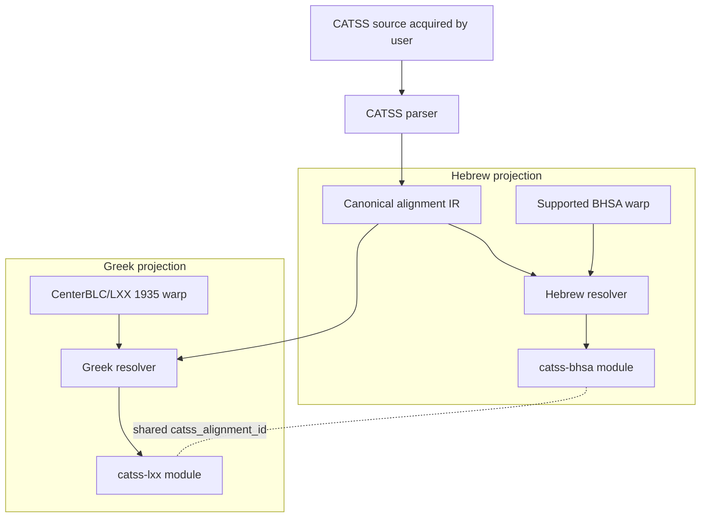

# Initial design

**Design date:** 2026-09-25  
**Status:** bootstrap architecture; unresolved choices are explicitly marked.

## 1. Product boundary

CATSS-TF is a software/materializer repository.

It produces two local Text-Fabric modules from user-acquired CATSS data and user-installed parent corpora:

- `catss-bhsa` for a supported ETCBC/BHSA version;
- `catss-lxx` for CenterBLC/LXX 1935.

It does not publish the source corpora or generated modules.

## 2. Architecture



The parser is shared. Parent-specific mapping lives in resolvers. TF serialization is a final projection step.

## 3. Canonical alignment IR

The IR should preserve CATSS evidence before any parent-corpus mapping.

Provisional model:

```python
AlignmentGroup(
    alignment_id: str,
    source_book: str,
    source_chapter: int,
    source_verse: str,
    source_rows: tuple[int, ...],

    mt_elements: tuple[SourceElement, ...],
    lxx_elements: tuple[SourceElement, ...],
    mt_retroversion: tuple[SourceElement, ...],

    is_lxx_plus: bool,
    is_lxx_minus: bool,
    transposition: Transposition | None,
    ketiv_qere: ...,
    sigla: tuple[str, ...],

    raw_provenance: SourceProvenance,
)
```

This is illustrative, not a frozen public API.

### ID requirement

`catss_alignment_id` must be:

- deterministic from CATSS source identity;
- stable across the two projections;
- independent of BHSA/LXX node numbers;
- insensitive to materialization order;
- able to identify discontinuous/multi-row groups.

The exact ID syntax is a design task after the source grouping rules are tested.

## 4. Text-Fabric projection model

A generated module contains no `otype` or `oslots` replacement and creates no nodes.

Each resolved parent word can receive features such as:

```text
catss_alignment_id
catss_alignment_role
catss_ratio
catss_lxx_plus
catss_lxx_minus
catss_transposition
catss_retroversion
catss_sigla
catss_source_ref
catss_source_rows
catss_mapping_status
```

Feature names are provisional. We should prefer normalized structured features for stable scholarly concepts and retain raw/source metadata for fidelity.

### Multiple group membership

Do not choose a delimiter encoding until CATSS evidence demonstrates whether a parent token can belong to multiple canonical groups. If multiple membership is real and frequent, the design must optimize queryability rather than hiding a list in an opaque string.

## 5. Mapping contracts

### Hebrew resolver

Input:

- canonical CATSS MT-side elements;
- one exact supported BHSA version.

Output:

- resolved BHSA word nodes for each CATSS alignment group;
- explicit mapping diagnostics.

Rules:

- use verse/reference mapping plus token content/normalization validation;
- preserve Ketiv/Qere distinctions rather than flattening them accidentally;
- do not map column-B retroversions to BHSA nodes as if they were MT tokens;
- never resolve by “closest available node”;
- fail/report when tokenization cannot be justified.

### Greek resolver

Input:

- canonical CATSS LXX-side elements;
- CenterBLC/LXX version 1935.

Output:

- resolved LXX word nodes;
- explicit diagnostics.

Common CATSS ancestry is an optimization opportunity, not a correctness assumption.

## 6. Failure model

Materialization is allowed to be partial only when the caller explicitly opts into partial output and receives a machine-readable failure report.

Default behavior for v0.1 should be fail-closed for unexplained mapping drift.

Diagnostics should distinguish at least:

- unsupported book/reference;
- versification mismatch;
- source parse ambiguity;
- parent tokenization mismatch;
- normalization-only mismatch;
- transposition/grouping ambiguity;
- parent version mismatch.

No exception should be silently converted to an omission.

## 7. Provenance

Each generated module must identify:

- CATSS source/acquisition path and source version/checksum where available;
- materializer software version;
- parent repository and exact TF version;
- materialization timestamp;
- unresolved mapping count;
- upstream license/terms references.

Per-alignment source row/reference should remain available where practical.

## 8. Packaging

Initial package name: `catss-tf`; Python import: `catss_tf`.

Expected future command surface:

```text
catss-tf materialize bhsa ...
catss-tf materialize lxx ...
catss-tf validate ...
```

The CLI is not implemented in bootstrap and must be designed/tested issue-by-issue.

## 9. Agora integration

Agora should register materializers only after CATSS-TF has a released, tested standalone materialization interface.

Agora should not:

- own CATSS parsing;
- vendor generated modules;
- repair mapping behavior;
- encode CATSS scholarly semantics independently.

## 10. Explicitly rejected designs

### Combined BHSA+LXX derived corpus

Rejected for v0.1 because it duplicates parent datasets, creates a new node universe, complicates updates, and is unnecessary for the initial research workflows.

### Cross-corpus TF edges using naked node IDs

Rejected because TF node IDs are warp-local.

### Two independent converters

Rejected because CATSS parsing/grouping semantics would drift.

### Prebuilt generated modules in this repository

Rejected because of upstream data licensing and parent-version coupling.


## 11. CATSS source/acquisition contract

The v0.1 materializer boundary is an explicit local path supplied by the user:

```text
user-acquired CATSS parallel directory
            |
            | direct child *.par files only
            v
    source inspection/fingerprint
            |
            v
       CATSS parser (#4)
```

CATSS-TF does not fetch CATSS over the network and does not treat installation of the Python package as acceptance of CATSS data terms.

### Source directory contract

The configured directory:

- must already exist;
- must contain at least one direct-child `*.par` file;
- is not searched recursively;
- may contain CATSS documentation or unrelated non-`.par` files, which are ignored by the parser input set;
- is fingerprinted before parsing.

The source inspector returns a deterministic manifest sorted by filename. Each entry contains relative filename, byte size, and SHA-256.

### Rejected acquisition designs

**Built-in downloader for v0.1:** rejected because CATSS-TF cannot satisfy or verify the CCAT declaration/registration requirements on the user's behalf.

**Depend on `curran-gehring/catss`:** rejected as the production source boundary because its code is CC BY-NC 4.0 and it adds a SQLite/morphology layer CATSS-TF does not require.

**Require the full CATSS tree:** rejected because only the parallel alignment is necessary for the initial modules.

**Recursive source discovery:** rejected because it makes source identity dependent on directory layout and risks silently consuming unrelated datasets.

### Future acquisition work

A future explicit acquisition command is not prohibited, but it requires a separate reviewed decision documenting a contemporary way to satisfy the applicable upstream terms. It must not be introduced opportunistically inside parser/materializer work.
